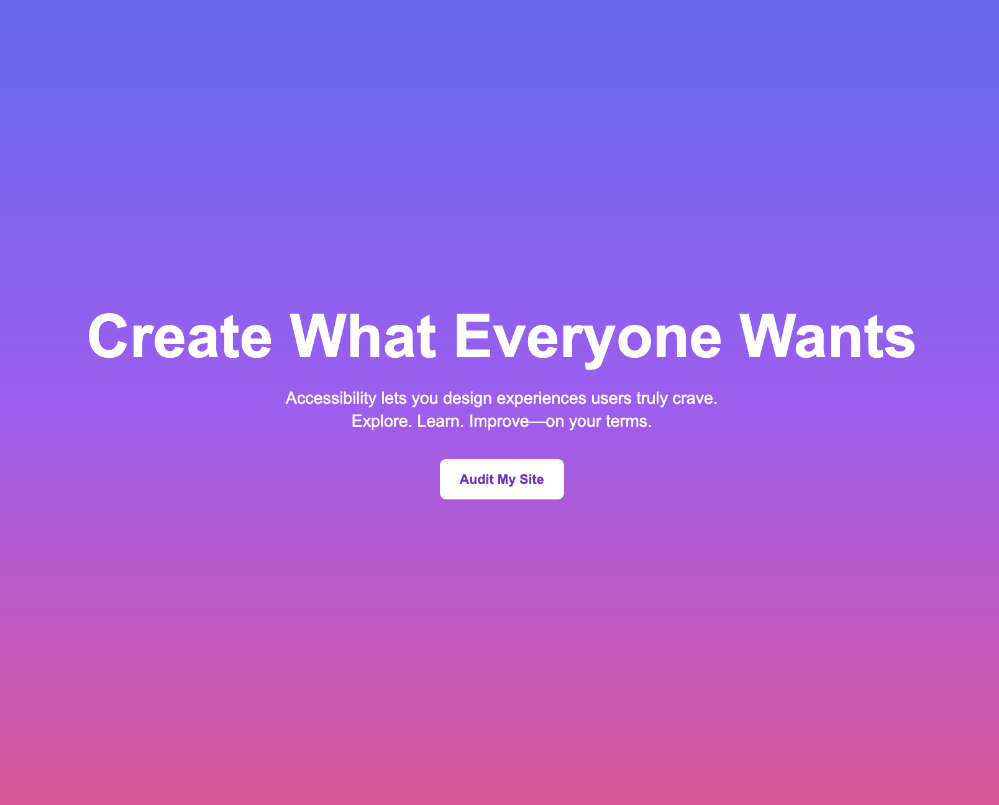
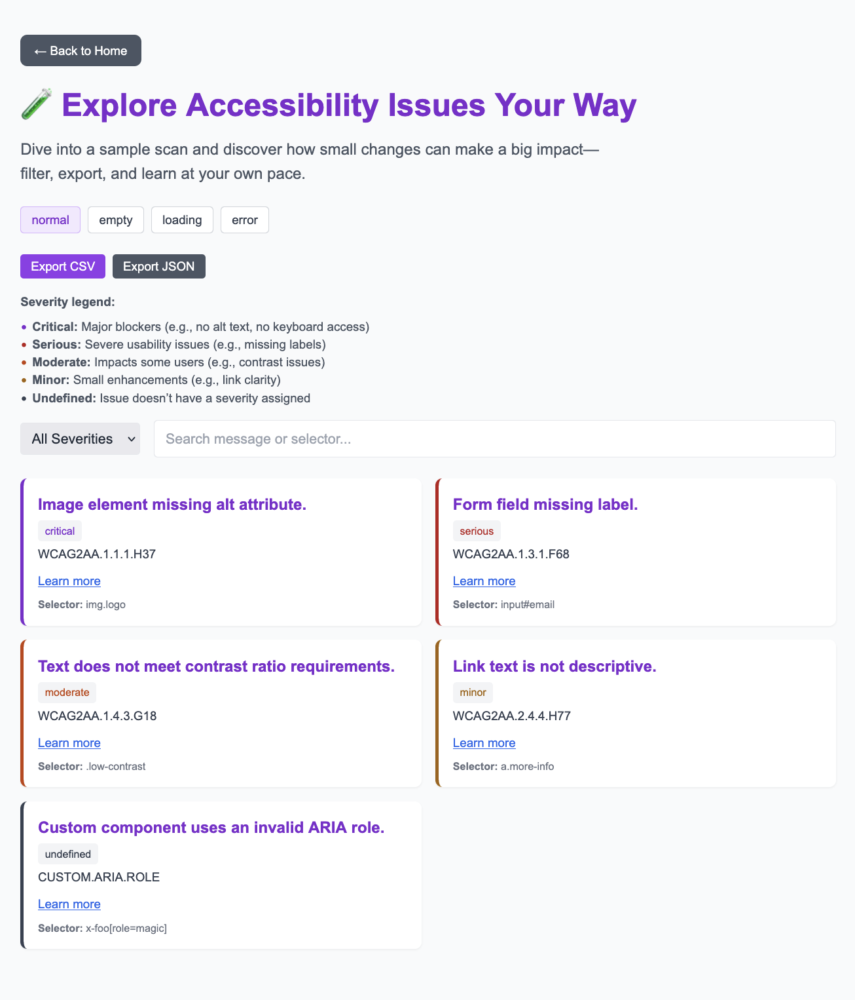
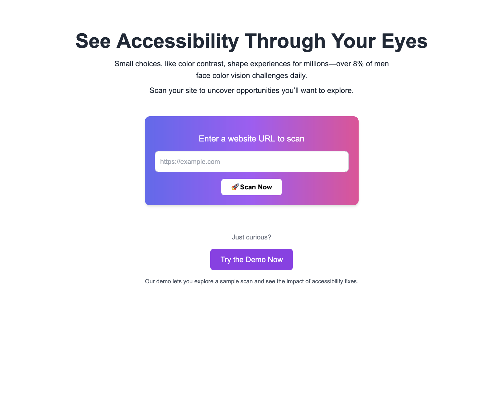

= Accessibly Yours
:author: Juan Carlos Collins
:revdate: 2025-04-25
:toc: macro
:toclevels: 2

Accessibly Yours is a React + Next.js web app that invites users to explore accessibility with clarity, creativity, and real-time insights. It’s built to showcase best practices in frontend engineering and to spark curiosity about how thoughtful design opens experiences for everyone.

== Motivation

This app was created to:

Demonstrate technical excellence in React, Next.js App Router, and performance-optimized architecture.

Empower developers to uncover opportunities for better web experiences.

Build a project that uses real-world audits and invites exploration.

== Architecture Overview

The frontend (accessibly-yours) is deployed on Vercel and communicates with a backend API (audit-api-fly) hosted on Fly.io.

Why this split?

Vercel streamlines modern frontend deployments with static generation and SSR support.
Fly.io enables full Node.js servers with headless browsers like Chromium—essential for real audits.

== Key Features

🔍 Scan any public website and explore accessibility opportunities
- Real-time audit of any public website
- See sample audit results from a demo

🧪 Powered by pa11y to surface real WCAG 2.1 audit results

📊 Export findings to CSV or JSON for further discovery

🧠 Clean, engaging UI built with Tailwind CSS, Framer Motion, and React

== Technology Stack

Frontend: React 18+, Next.js App Router, TypeScript, Tailwind CSS, Framer Motion

Testing: Jest, React Testing Library

Deployment: Vercel (frontend), Fly.io (backend with Puppeteer)

Audit Engine: pa11y, headless Chromium

== Setup & Development

Clone the repository

Run npm install

Start local dev server: npm run dev

Environment should point to: https://audit-api-fly-01.fly.dev

== Deployment

Push to main branch → auto-deploys to Vercel

Live app: https://accessibly-yours.vercel.app

== Accessibility Principles

- Use of semantic HTML to support screen readers and keyboard navigation

- Clear visual focus indicators for all interactive elements

- Strong color contrast and scalable typography

- Designs that respect user choice and motion preferences (in-progress)

- Storytelling that celebrates curiosity, agency, and clarity

== Audit Results

image::https://img.shields.io/badge/Lighthouse-100%20Performance,%20Accessibility,%20Best%20Practices,%20SEO-brightgreen.svg?style=flat-square&logo=lighthouse&labelColor=202124[Accessibly Yours Lighthouse Score Badge]

*All categories scored 100 in latest Lighthouse audit (FCP: 0.3s, LCP: 0.5s, CLS: 0, TBT: 10ms).*

- 🚀 **Smart Local Storage Caching**:
  - WCAG/pa11y audit results are cached per URL.
  - Lighthouse Site Quality scores are also cached per URL.
  - Reduces network calls, improves reload speeds dramatically.

== Gotchas / Notes

Tailwind CSS SSR hydration is needed; thus, GitHub Pages was not viable.

All audits are proxied through the Fly.io backend to enable headless browsing.

This app emphasizes exploration rather than enforcement of standards.

== Future Enhancements

✨ Visualize audit results with charts and scores

✨ Offer smart fix suggestions based on audit results

✨ Progressive Web App (PWA) support for offline exploration

✨ Deepen motion accessibility for reduced-motion users

== Related Project

See the paired backend server: https://github.com/juancarlucci/audit-api-fly